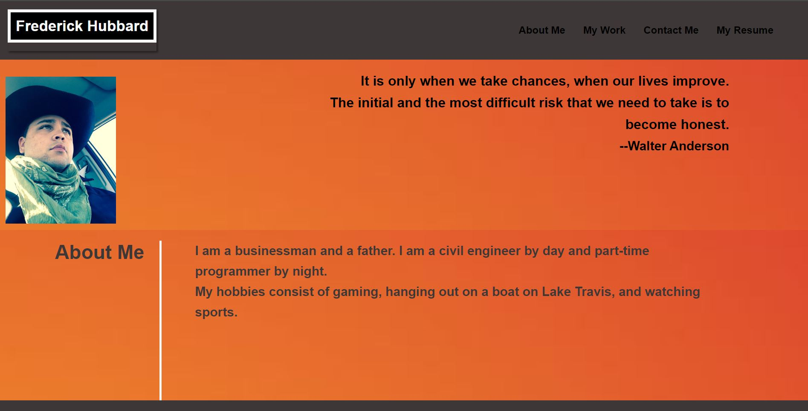

# project-2

Purpose of this assignment create a HTML page using Advance CSS to create a personal Portfolio. 

Created HTML and CSS

    Added Resume
    Added Portfolio
    Added Developer Name and Photo
    Added About Me, My Work, and Contact Information
    Added Clickable Links
    Added UI Scrolls, Titled Images 
    Resize the page and view for multiple devices
    Revised CSS to match HTML

Deployed URL: https://f4stfreddy.github.io/project-2/ GitHub Repo URL: https://github.com/f4stfreddy/project-2.git

